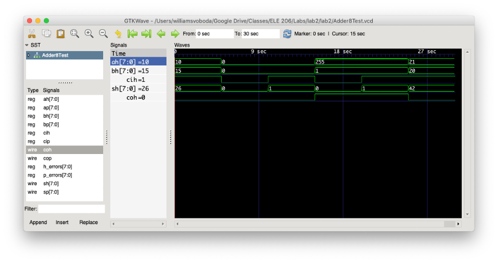

# Lab 2 Write-Up

## Tutorial Review Questions

1.6

a. x and y will both contain only 0’s, but x will have a bit width of 6 since it used a bitwise AND while y will be 1’b0.

b. & is bitwise AND meaning it operates on each pair of bits in the operands, while && is logical AND so it returns a single bit (either 1 or 0 if there is no impedance or unknown value).

c. ! is logical negation, so !0 will return a 1. The wire a does not carry a single bit, so !z is actually just 1’b0. To get the intended effect, you could just use the bit-wise negation operator ~.

2.2

A port is a connection used for sending data to a module and receiving data from a module. An input port is always a wire within the module (meaning they are read-only) while output ports are wires by default but can be made into regs if specified.

2.4

To reference another file in Verilog you can use the include directive along with the file path. Instantiating a module is the same whether it’s from the same file or not, but if it’s external you need to use the include directive to specify its location.

2.5

a. The programmer could start by having a module definition called “module MyXorGate” with two input ports and one output port. Then the programmer would just need to abstract the internal logic under the definition and assign the output to the output port.

b. A top-level module is a module with no ports that cannot be instantiated. They are the entry point for the full circuit and are usually used for testing the circuit in simulation.

7.1

Because Verilog is a hardware description language, finding a bug in production means that the circuit in question was already manufactured. Physical hardware can be extremely expensive to realize, so for a developer at Intel that produces circuits at scale a bug would mean having to scrap the buggy circuits and refabricate them at an immense cost.

7.2

a) To specify a delay, you just need to use a hashtag and the number to delay by, such as “#5”.

b) The timescale directive sets the units of delays. In the example above, the timescale is 10 ns and the precision is 10 ps.

c) Delays are useful because they can separate checking outputs from assigning inputs and they can also separate individual test cases from each other.

7.4

a. The final text would read “Test Number 1 completed. Result is F.”

b. To print the test number as an octal value you can use “%o” to format it as octal:

`$display("Test Number %o Completed. Result is %h.", x, y);` 

7.5

Adding the $finish directive to the end of the simulation’s initial procedure will end the simulation. If this is not done, the simulation will not exit and will continue to run.

7.6

Using those operators in testbenches allows one to check for a bitwise exact match even if there are X and Z values. This means you can properly test for error conditions where the output is one of those values.

## Lab Write-Up Questions

Question 1:

Verilog allows for both continuous and procedural assignment. In continuous assignment only wires are used. In procedural assignment the reg datatype is the target of assignments, but a reg acts like a wire when used in a procedural block.

Question 2:

The hierarchical 8-bit adder is best described as structural Verilog, because it was written using modules that explicitly defined the representation of the circuit. In other words, the hierarchical adder represented more closely how it would be implemented in hardware. On the other hand, the procedural adder had far less code mainly because it only expressed the intended circuit behavior. For example, the use of the “+” operator allowed for addition without actually needing to deal with the gate-level structure.

Question 3:

Using procedural implementation drastically reduces the amount of code needed to express the intended behavior in a circuit. However, it sacrifices control over the final hardware implementation which could lead to better implementations being ignored (less costly, faster, etc.). Hierarchical implementation addresses this downside by allowing gate-level representation of a circuit, but it often requires more code to be written and forces the programmer to consider very fine details. A similar comparison is seen when using arithmetic operators instead of bitwise ones. A “+” operator, for example, allows for simple addition but introduces problems when there is confusion on whether the addition is signed or unsigned.

Question 4:
My first test case involves the scenario when nothing is added together and there is no carry-in bit. This helps test that there is no hidden bug that always adds to the final sum. My second test case is very similar except that it checks if the sum is 1 and carry-out is 0 when the only non-0 input is the carry-in bit. This ensures that the carry-in functionality works correctly in the adder. My third and fourth test cases both check that the carry-out is actually used. The third test ensures that 255 (the largest decimal number that can be represented in 8 bits) plus 1 will produce a sum of 0 and a carry-out of 1. The fourth is almost the same but includes a carry-in of 1 to ensure that when a carry-out is performed the 8-bit sum is still updated. The final test case is just a random check that 21 + 20 + 1 = 42.

Question 5:

The signals ah and bh represent the addends for the addition to be performed with values 10 and 15 respectively, while the waveform for cih confirms that the carry-in bit is 1. The signal sh represents the resulting sum from the adder, and since (from the waveform) its value is 26 we can confirm the sum is correct since 10 + 15 + 1 = 26. The observation that coh is 0 also helps confirm the adder works since there should be no carry-out for this particular addition.

Question 6:

This lab took approximately 3 hours with the tutorial review questions taking an additional hour beforehand. I initially found the use of the “+” operator somewhat daunting since we have never actually used it before, but once I realized how simple it was the procedural 8-bit adder went very fast. I appreciated that there was some boilerplate provided for us to create test cases, as it gave a good standard for what a testbench should look like.
