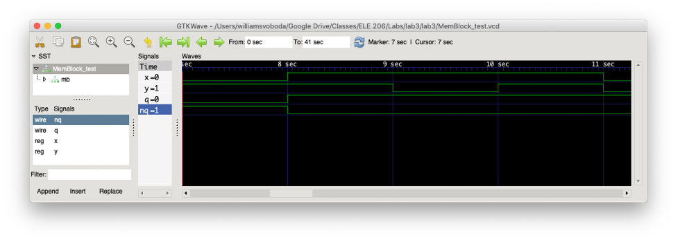
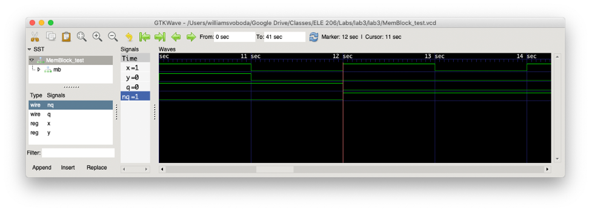

# Lab 3 Write-Up

## Tutorial Review Questions

1.10

a. The value of the wire will most likely be X, or indeterminate, because the code attempts to drive the same wire by two different signals

b. Verilog is naturally concurrent. This means that there is no “order” to assignments, so two assignments cannot made to the same wire because it would be impossible to assign them at the same time. This is similar to how real hardware behaves, since hardware is continuous and parallel in the same way as Verilog.

1.12

The if block will trigger when the value inside the parentheses is non-zero. Since the wire x is a vector, it will be considered to be non-zero if any bit in the vector is a one.

3.1

The output of combinational logic depends only on its current inputs. In contrast, sequential logic depends on the past value of its values. This means that sequential logic requires memory and is created in Verilog using the reg datatype and a sequential always procedure. 

3.2

a) An always procedure for a sequential circuit does not contain all right-hand-side signals, but instead has a single modifier indicating whether the procedure runs on a rising edge or falling edge. In addition, the reg datatypes which are assigned to are treated as flip-flops and not wires. Finally, a new non-blocking assignment operator can be used.

b) The code above uses the posedge modifier, meaning that it is triggered by the rising edge of the clock signal. One could use the negedge modifier if they wanted the memory element to be triggered on the opposite clock.

c) The circuit uses non-blocking assignment. While non-blocking assignments execute in order the same way that blocking assignments are, the registers that are assigned to are not immediately updated. The updates are only run after the procedure has finished executing, so in essence there is a delay between input and output.

3.3

a) It is good practice to use non-blocking assignment because sequential logic typically requires a delay between input and output (such as in a shift register). A blocking assignment would prevent registers from simultaneously receiving old values, which does not fit with multi-stage sequential logic.

b) You could simply change each blocking = operator with the nonblocking operator <=.

3.4
In implementations of sequential logic, the reg datatype behaves like a flip-flop style register. This means that it stores a single bit (either 1 or 0). In contrast, combinational logic causes the reg datatype to act like a wire, meaning that it would only carry a value and not itself actually store it.

7.3

a) I would either specify a timescale of “`timescale 20ns/10ps”, or alternatively go with the default timescale from the compiler (which usually works perfectly fine).

b) 

```
reg clk =1;

always begin
	#1 clk = ~clk;
end
```

The timescale is 20ns, so to get a clock period of 20ns I used #1 since it represents a delay of 1 * 20ns (or just 20ns).

## Lab Write-Up Questions

Question 1:

If the stored bit is 1 and the input is (1, 1), the NAND from the top gate would take 1 and 1. This would output 0, which would feed into the top input of the bottom gate. This 0 is then NAND’ed with the 1 from the R signal (producing 1), so the stored signal would remain 1. If the stored bit was 0, the NAND from the top gate would take 1 and 0. This would output 1, which would feed into the top input of the bottom gate. This 1 is then NAND’ed with the 1 from the R signal (producing 0), so the stored signal would remain 0.

To store one bit of information (such as when one wishes to store logical 1), you could for example make not set go to 0 and keep not reset at 1. On the top gate, this would NAND the 0 from not set with the whatever bit was already stored. This would always be 1, so the bit 1 would be stored. Even if not set returned to 1, by self-reinforcement the stored value would persist.

The truth table for this circuit is

| S | R |     Q     |     NQ    |
|:-:|:-:|:---------:|:---------:|
| 1 | 1 |   Latch   |   latch   |
| 0 | 1 |     1     |     0     |
| 1 | 0 |     0     |     1     |
| 0 | 0 | Forbidden | Forbidden |

Question 2:

When both not set and not reset are 0, both Q and not Q would be 1. If both inputs changed from (0,0) to (1, 1) at the same time, a race condition would occur where we would not be able to determine what the outputs would be (that is to say what is stored). This is because the outputs would continue feeding back into the inputs for both gates, causing an oscillation between 1 and 0. In a real circuit, the delays of the gates and wires would be slightly different so eventually a stable value would be reached.

Question 3:

The problematic transition from (0,0) to (1,1) would cause repeated oscillation between 1 and 0. If a simulator is single-threaded, the order it evaluates each part of the circuit might cause different results to be produced because the self-reinforcement means that the output of each gate is one of the inputs of the other gate. For example, if the circuit evaluated the top gate first, the inputs fed into the bottom gate might be different than if the bottom gate was evaluated first.

Question 4:

One important consideration a designer should make is regarding how set and reset signals are perceived. If the rest of a memory system uses SR latches that interpret a “Set” signal as 1 and a “Reset” signal as 0, the designer will need to invert the signals before including an SR latch that uses NAND gates (since it assumes the inputs are “Not set” and “Not reset”). In addition, it would be helpful to standardize the delay between one of the inputs changing in order to prevent oscillation.

Question 5:

The structural implementation of the latch made it easy to see how the circuit might be translated to hardware. It was clear that self-reinforcement was created by having each gate’s output be one of the inputs of the other gate. However, the structural code required foresight to see how each assignment operation would produce the intended behavior. On the other hand, the behavioral implementation made it extremely easy to simply state the intended behavior for each input condition. While this would reduce control over a final hardware implementation, I think it is a superior approach because its simplicity makes it easier to understand the circuit’s output behavior and reduces the chance for errors.

Question 6:

The circuit behaves the most like a D flip-flop that is triggered by the positive edge of the clock. The input x is a clock signal, which when high will set one of the outputs to go high (and the other low) depending on the other input signal y. The bit is stored immediately on the positive edge of the clock (right when x goes high).



The screenshot above shows the test bench running from 7 seconds to roughly 11 seconds. Even though y, the data input, is 1 the output q does not go high until right when the clock signal x goes high. Similarly, after 9 seconds y changes between 1 and 0 repeatedly but q does not change because a rising edge on the clock signal has not occurred yet.



The screenshot above shows the test bench running from 10 seconds to roughly 14 seconds. Here we see a different set of outputs occur. When the next rising edge occurs on the clock signal x, the data input y is 0. This means that at 12 seconds q goes low while nq goes high. In both screenshots, q and nq are shown to be inverses of each other under normal operation.

Question 7:

The structural MemBlock module uses three Latch instances, the structural versions of which have two NAND gates each. Along with the extra AND gate used to handle the three-input NAND gate from the diagram, there are 7 two-input gates in the circuit. In the textbook, the example shown for a D flip-flop was implemented using two D latches. Each D latch has 4 two-input gates, so the reference D flip-flop has 8 two-input gates overall. This is actually more than the MemBlock circuit, so (along with the fact that any circuit can be made with NAND gates) the MemBlock circuit likely uses less transistors than the textbook version.

Question 8:

This lab was definitely a step up from the last two. It took me 8-9 hours to complete each part. I wish more explanation was given either beforehand or during the lab on compilation options; I had no idea that include statements could be substituted for putting the module file in the compilation command in the terminal, which gave me a multiple-declaration bug for a while. In addition, while we went over storage circuits in lecture I don’t think we had as much exposure to D latches and D flip-flops as we did with S-R latches.
