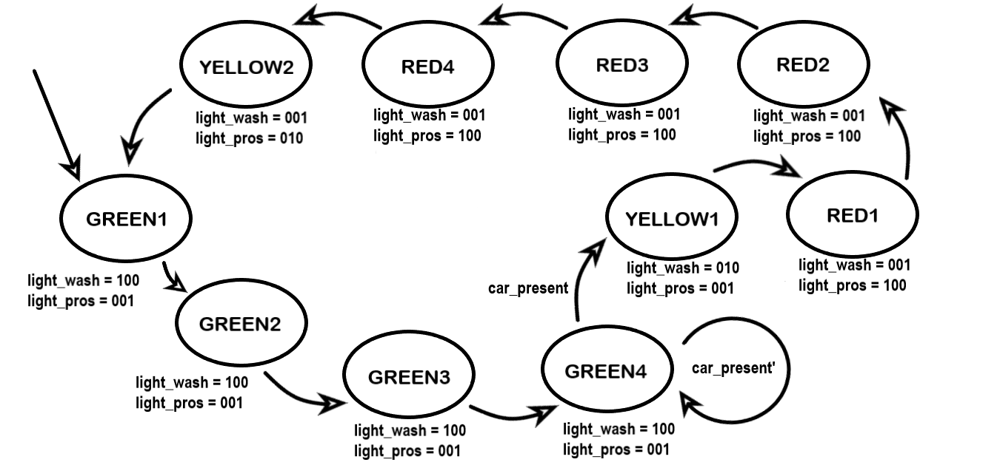

# Lab 4

## Team Members

* Epi Torres: [epifanio@princeton.edu](mailto:epifanio@princeton.edu)
* William Svoboda: [wsvoboda@princeton.edu](mailto:wsvoboda@princeton.edu)

## Tutorial Review Questions

4.1 

The ```localparam``` and ```define``` statements can both be used to define constants. While ```localparam``` statements need to be declared within a module and are inaccessible outside of that
 module, ```define``` statements are usually declared outside of any module and can be used anywhere its file is included.

4.2

a) The ```parameter``` type works very similarly to the ```localparam``` type, except for the fact that constants defined with the ```parameter``` type can be modified each time we instantiate a new module. Using the ```parameter``` type prevents us from having to redefine the same module with different constants.

b) 
```verilog
module MyBitwiseAndGate
#(
    parameter BIT_WIDTH = 2
)(
    input [BIT_WIDTH-1:0] a,
    input [BIT_WIDTH-1:0] b,
    output [BIT_WIDTH-1:0] out
);

    assign out = a & b;

endmodule
```

c)
```verilog
wire [7:0] a, b, out;

MyBitwiseAndGate #(
    .BIT_WIDTH(8)
) myGate(
    .a(a),
    .b(b),
    .out(out)
);
```

5.1

a) In an FSM, the purpose of a *state register* is to hold the current state of the machine.

b) A state register is typically implemented *sequentially*.

c) The first function is to load the initial state of the FSM when the ```reset``` signal is high (during the relevant clock edge). The second function is to load the value
 produced by the next state logic (on the relevant clock edge).

5.2 

a) The purpose of *next state logic* is to produce a wire that holds the next FSM state based on the current state and inputs.

b) When ```reset``` goes high, the next state logic is ignored and the state register will simply load the initial state.

c) Implicit latching can be prevented by assigning a default value to the ```next_state``` variable. A good default value would be the current state of the FSM.

5.3 

Whereas the output values of a Moore machine are based solely on its current state, the output values of a Mealy machine are based on both its current state and current inputs.


## Write-up Questions

**Write-up Question 1:**



**Write-up Question 2:**

An FSM is composed of a state register, output combinational logic, and next state combinational logic: 

The state register is triggered on the relevant clock edge and serves to hold the current state of the machine. If the ```reset``` signal of the FSM is high on the relevant clock edge, then the state register will load the initial FSM state; otherwise, the state register will load the state value produced by the next state logic.  

The next state logic uses the current state and inputs to produce the value of the next state of the FSM. 

As the name suggests, the output logic produces the output signals of the FSM. If the FSM is a Moore machine, then the values of these output signals are based on the current state of the FSM. If the FSM is a Mealy Machine, then the output signals are based on the current state and inputs. 

**Write-up Question 3:**

This lab went a lot smoother than previous ones. It helped greatly to have a partner, 
as it allowed us to ask questions and better understand key concepts. We were  momentarily stuck on some of the additional tests for the testbench, but were 
able move on after carefully tracing through the FSM to find the intended output to test for. The lab took around 4-5 hours overall.
