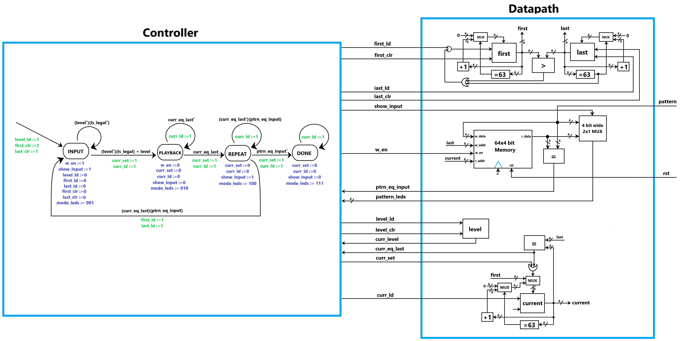

# Lab 5: Simon

## Team Members

* Epi Torres: [epifanio@princeton.edu](mailto:epifanio@princeton.edu)
* William Svoboda: [wsvoboda@princeton.edu](mailto:wsvoboda@princeton.edu)

## Write-up Questions

**Write-up Question 1:**

For our controller testbench, we started by writing simple tests 
that ensured that the LEDs were set correctly and that transitions between different states, such 
as from *Input* to *Playback*, occurred successfully. Our primary concern was checking that each state transition was correct. 
This is important because if transitions didn't occur properly the controller could, for example, 
be writing memory incorrectly and would produce incorrect game behavior. Additionally, our FSM diagram
showed certain outputs that happened during transitions. We wrote test cases that checked that this
was actually captured successfuly, because it ensured that the *current* index register was being set 
to its intended value each time.

For our datapath testbench, we wrote tests to write and read data to/from memory. This is important because 
writing new patterns during the game while also being able to recall past patterns is critical to gameplay. 
In general, because the controller depends on datapath outputs to handle state transitions, we wanted to make 
sure that the datapath was producing these outputs correctly as well. We also wrote a test that wrote 65 patterns to memory, because
this would allow us to ensure that the wrap-around behavior of the game would actually occur.

**Write-up Question 2:**

For the *Done* state, we had to add a case for the *current* index to properly wrap it around when there were fewer than 64 
patterns written to memory when the game ends. Additionally, we changed the logic for the *first* index in order to properly 
increment it whenever the *last* index reached the last index in memory. We also changed the implementation of the *is_legal*
high-level module into a simple conditional check within the datapath module, instead of creating a separate module that used 
bit-level operations to check legality. While our diagram did not use the 
*reset* signal for the memory module, in our Verilog code we actually did use it in 
order to reset the memory in our testbenches. Finally, while our initial FSM 
diagram showed a fifth *Start* state to handle starting a new game after turning on 
the device, we actually encapsulated the necessary logic in our *Input* state in our 
code.

**Write-up Question 3:**

We started our functional tests with the same example "Alice and Bob" gameplay sequence. We felt that it provided a good basis 
to test a typical easy mode Simon game, specifically how each possible state transition occurs and how players might attempt to change the 
level during the game. 

After this, we reset the device and began a new hard mode game. During this hard mode gameplay sequence,
only one pattern was stored in memory before the game ended. The purpose of this was to test that the *Done* state would only
display the single pattern in memory after each clock edge.  We also tested that hard mode would actually allow patterns in the *Input* 
state that would normally be illegal during easy mode (by verifying a transition to the *Playback* state). We also confirmed that 
changing the pattern input during the *Playback* state would still not change the pattern in memory.  

After this first hard mode gameplay sequence, we reset the device and started a second hard mode gameplay sequence. This second hard 
mode gameplay sequence specifically tests the looping of the *Repeat* and *Playback* states when the game is set to hard mode. These tests expand on the 
original testbench, namely by setting the game mode to hard.

## Combined Datapath & Controller
Our combined diagram is below. As you can see in the diagram, our datapath is equipped to handle the wrap-around logic for storing 
more than 64 patterns in memory.

