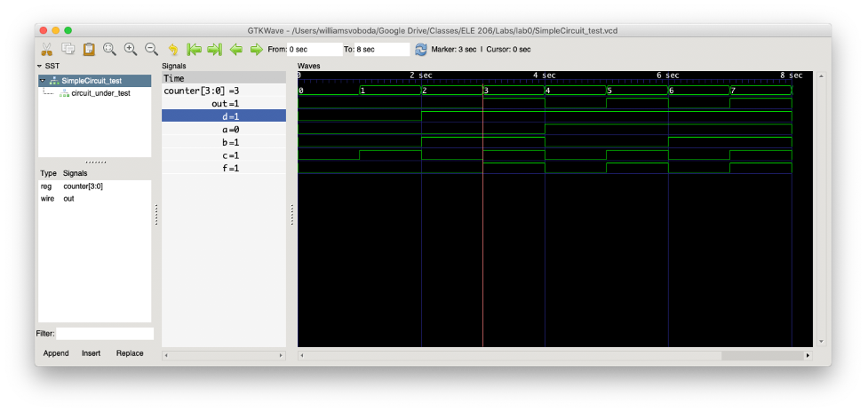

# Lab 0 Write-Up

## Tutorial Review Questions

1. First, you will need to change directories using the cd command to make bar the current directory. Then, the files in bar can be shown by using the ls command. To make foo the current directory again use the command cd .. to return to the previous directory.

2. 

The output of the circuit is what I expected. When a=0, b=1, and c=1, the output wire f of the SimpleCircuit module will be 1 since f is assigned to the logical and (&&) of wires d and c (which since d is 1 as it is assigned to a || b the expression d && c is 1). Since the module output is 1 at this point in time, it is expected that the wire out will also be 1. The wire out oscillates between 1 and 0 every second from this point onwards until the simulation end.

3. The entire simulation ran for 8 seconds of simulated time.

4. I spent about 3 hours on this lab, the majority of which was spent installing the software and reading the first two chapters of the Verilog tutorial.
