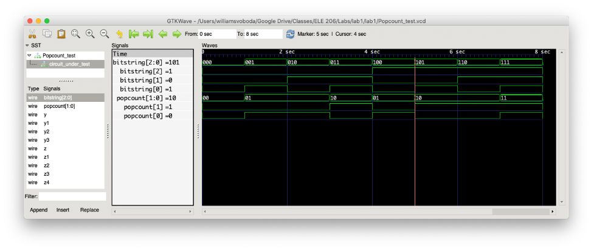
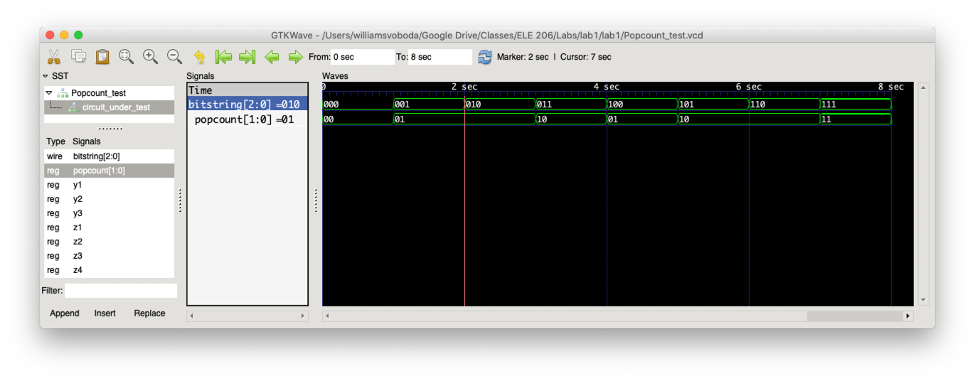
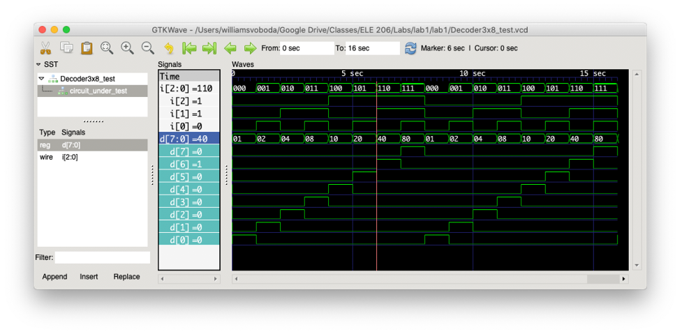

# Lab 1 Write-Up

## Tutorial Review Questions

1.1 

Unlike Java or other high-level programming languages, you can use Verilog to express concurrent statements. In practice, this means you need to consider the possibility that operations are done in parallel. Since Verilog is so low-level the potential complexity is far greater for operations that might be more straightforward in Java. Program design might need to take into account the final hardware design as certain operations (i.e. multiplication or division) will depend on the hardware implementation used.

1.2

Being driven means that wires do not actually hold values but instead derive their value from the input given to the wire. A wire that is not being driven means nothing is connected to the input of the wire, so it has high impedance and is in effect disconnected. If there are multiple drivers to the same wire, then there can be an issue if the signals do not match; the assignment of both a 1 and a 0 to the same wire will lead to the value X (indeterminate).

1.8

Continuous assignment means that a wire or vector of wires is driven continuously by the output of an operation. This means that if the value of the driver changes the value carried by the wire will also change instantaneously. Continuous assignment describes hardware more naturally because hardware is inherently continuous and parallel. On the other hand, in procedural assignment code is run procedurally when one of the signals in the sensitivity list changes.

1.11

a. SimpleCircuitA is structural Verilog since it only uses wires and continuous assignment, while SimpleCircuitB could be classified as behavioral because it uses procedural assignment.

b. The first module uses continuous assignment, as d and f are continuously assigned based on their drivers. The second module uses procedural assignment, as it is using a sensitivity list instead to execute how values are assigned to d and f. However, their functionality overall is the same.

c. The procedure would not be triggered again. In Verilog, a change to a variable within an always block cannot trigger that same always block. In this case, the signal d does not need to be in the sensitivity list. It only changes if the expression a || b changes (with those identifiers already in the list), and the next statement in the block (f = d && c) already takes care of adjusting f if d changes.

d. The sensitivity list could be improved by changing it to the catch-all list using symbol *, since it would automatically capture any identifier that could cause a change in the procedural execution.  This would prevent problems that could arise in a manually created list where an identifier was forgotten.

e. The continuous style seems more intuitive here, since this module is so small that there are there are only two assignments to worry about (to d and f), whereas with the procedural style you need to worry about the sensitivity list and the potential for forgetting an identifier (if not using the *-based list).

2.1

Code complexity is also a problem in other programming languages, but especially in Verilog it is so low-level that there can be a very high number of registers and wires in large circuits. By using modules, we can break down a circuit design into parts that are small enough to test and understand while also avoiding code duplication. 

## Lab Write-Up Questions

Question 1:

From the waveforms for the individual bits, we can actually see the length of time that an individual bit was at a certain value, for instance how bitstring[2] was equal to 1 starting from four seconds onwards. This aligns with how the decimal value of bitstring is greater than or equal to 4 under that same time interval (which makes sense since the input increases by 1 every second).

Question 2:

From the 1-second mark onwards the compacted waveform for bitstring and popcount are both 1. This makes sense, since the value of bitstring counts up over the time interval and thus popcount should always record at least one 1. Additionally, by comparing the specific value of each signal at each second we can confirm the computation is correct for all points in time. For example, at the two second mark bitstring is 010 and popcount is 01 (so popcount successfully counts there is a single 1 in the input signal. We can even see that on certain intervals popcount maintains the same value, which makes sense since for example the binary representations of the numbers 1 through 2 both contain a single 1.

Question 3:

One might prefer to write the module in structural Verilog if they want greater control over the design of the final circuit since it would allow for different implementations of the same function. On the other hand, if one is only immediately concerned with the behavior of the circuit, they might prefer using behavioral Verilog since they could specify circuit behavior without knowing the final implementation. If one is only worried about simulation without the intention of actually implementing the circuit in hardware, then behavioral Verilog might be best.

Question 4:

One of the errors the compiler generates is for a syntax error on line 3. This is due to the declaration for the output signal d missing an opening bracket. This is also what causes the related error on line 1 where the compiler identifies an error in port declaration. The remaining errors are all caused either by incorrect syntax or by invalid module items. However, these can all be traced to a missing semicolon in the declaration for reg d.

Question 5:

No, the buggy code does not successfully implement the decoder combinational circuit. A decoder should set exactly one of its 2^n outputs to 1, however it can be easily seen from the waveforms in GTKWave that almost the opposite is happening. More than one output bit is set to 1 from one second onwards, so the circuit behavior is not as intended.

Question 6:

Addendum (not an answer to any question):
The graph of the decoder when written with structural Verilog looks like

Question 7:

I preferred writing this module in behavioral Verilog. Using a behavioral approach let me focus less on the actual implementation of the circuit and more on the intended behavior. In particular, writing the procedural code within the always block allowed me to define the value of the output signal in a straightforward way. If I wanted d[4] to be set to 1 when the decimal value of the input was 4, all I had to write was the label for a 3-bit value of 4 and assign d[4] = 1'b1. On the other hand, if someone was interested in finer control on the final hardware implementation a structural approach would allow them to do so. For example, the AND operations on the inputs would have to be explicitly listed. I did not prefer this because this approach introduced potential for syntax errors (the repeated use of AND and NOT) and the assignments were not as straightforward a way to set the value of each output bit.

Question 8:

Overall, the lab went pretty well as a first “real” exercise in Verilog. It took me around 5-6 hours to do the entire lab, but this also included logistics and doing the review questions. I was momentarily stuck on how to assign a single value to multiple registers, and also had to take time to remember chaining operators together for multiple wires. I do think that while the Verilog tutorial was effective that some of it should be covered in lecture. I think there’s a disconnect between the lectures that teach circuit concepts and the labs that actually involve using Verilog. This is probably by design, but it would be nice to see in lecture examples of Verilog code with good style rather than the shorter snippets in most of the tutorial pdf.
