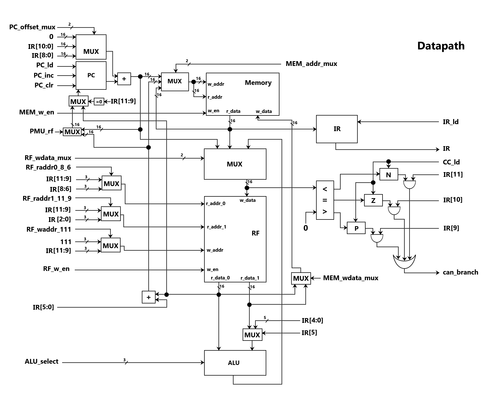
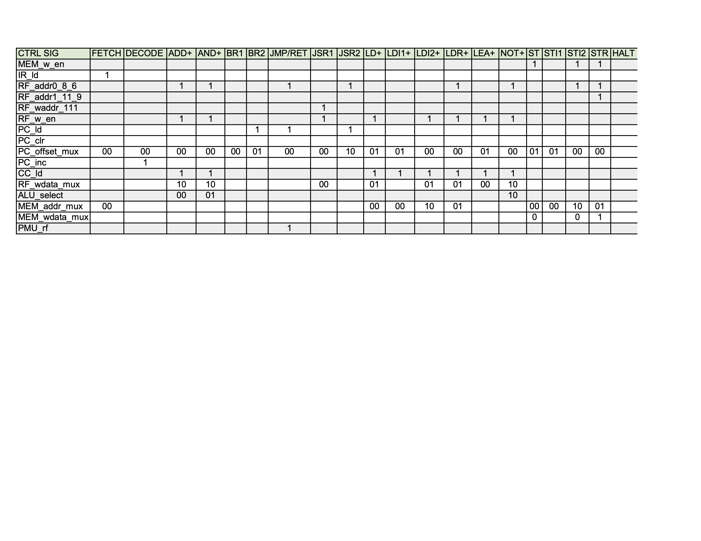

# Lab 6: PUnC

## Team Members

* Epi Torres: [epifanio@princeton.edu](mailto:epifanio@princeton.edu)
* William Svoboda: [wsvoboda@princeton.edu](mailto:wsvoboda@princeton.edu)

## Datapath



## Control Signal Table



## Assembly Program

```
\*0 *\ LD R0, #29           // Loads base into R0
\*1 *\ LD R1, #29           // Loads index into R1

// If the index is 0, stores 1 as the resulting power.
// Otherwise, calculates the power.
\*2 *\ BRp #3               // If index is positive, branches
\*3 *\ ADD R1, R1, #1       // Sets value of R1 to be 1
\*4 *\ ST R1, #27           // Stores value of R1 at memory address 32
\*5 *\ BRnzp #13            // Unconditionally branches to HALT

// Initializes the registers for exponent calculations
\*6 *\ ADD R2, R1, #-1      // R2 = R1 - 1
\*7 *\ LD R3, #22           // Loads base into R3
\*8 *\ LEA R6, #11          // Loads location of multiplication function in R6

// The exponentiation loop
\*9 *\ JSRR R6              // Jumps to Multiplication function
\*10 *\ ADD R2, R2, #-1     // R2 = R2 - 1
\*11 *\ BRp #-3             // If R2 > 0, continue looping

// If base is negative and index is positive, stores the absolute value of the resulting power.
// Otherwise, stores the resulting power.
\*12 *\ AND R1, R1, #1      // If R1 is odd, R1 = 1. Otherwise, R1 = 0.
\*13 *\ BRp #4              // If R1 is odd, branch to store instruction
\*14 *\ ADD R0, R0, #0      // Sets condition codes based on value of R0
\*15 *\ BRzp #2             // If R0 >= 0, branch to store instruction 
\*16 *\ NOT R3, R3          // Otherwise, calculate the twos complement of R3
\*17 *\ ADD R3, R3, #1
\*18 *\ ST R3, #13          // Store R3 at memory address 32
\*19 *\ HALT

// Multiplication function: base * base
\*20 *\ LD R4, #11          // R4 = 0
\*21 *\ LD R5, #8           // Loads the base into R5
\*22 *\ BRzp #2             // If the base is positive, branch to address 25
// If the base is negative, takes the two's complement of R5
\*23 *\ NOT R5, R5          
\*24 *\ ADD R5, R5, #1
\*25 *\ ADD R4, R4, R3      // Adds the current power to R4
\*26 *\ ADD R5, R5, #-1     // R5 = R5 - 1
\*27 *\BRp #-3              // If R5 > 0, continue looping

\*28 *\ ADD R3, R4, #0      // R3 = R4
\*29 *\ RET

\*30 *\ FFFD                // The base of the exponent
\*31 *\ 0004                // The index of the exponent
```

### Explanation

Our assembly program takes two arguments, a base and an index (i.e. the exponent), and finds the corresponding 
power. This program allows for the base to be negative, but does not support negative 
indices. The program first loads in the base and index arguments from memory into registers. 
If the index given is equal to zero, the program will not perform any computation and will instead 
store the value 1 as the power (following the multiplicative identity). The actual computation is 
performed using two nested loops. The first tracks the current power; the second uses repeated addition to 
perform the multiplication for that power. The final power is then stored in memory.

## Feedback

Overall we really enjoyed this lab. We spent a substantial amount of time trying to fix all of its bugs, but we felt that the 
challenges we faced were fair. We would have appreciated if the LC3 assembler would allow the 
size of the left-hand window to be adjusted. Additionally, computing the offsets manually for long programs is also extremely 
tedious. It would be great if labels were supported in the assembler to avoid this.
